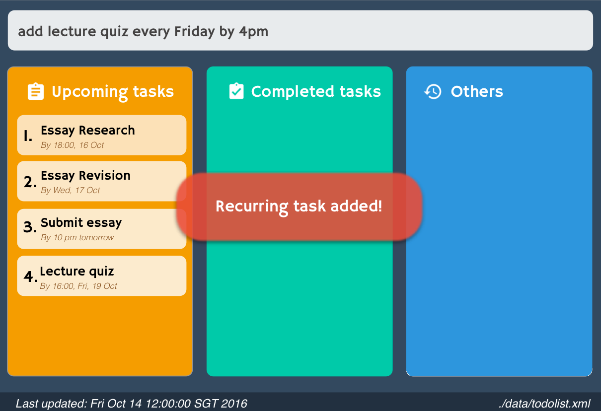

---
title: "Features"
bg: "#34435b"
color: white
fa-icon: lightbulb-o
style: center
---	

### Features

Support add, delete, rename, schedule, mark, unmark tasks.   
	   

Support find and list tasks.   
	   

Support recurring tasks.   
	   

Allow creating an alias for your own command.   
	   

Allow specifying your own data storage location.   
	   
