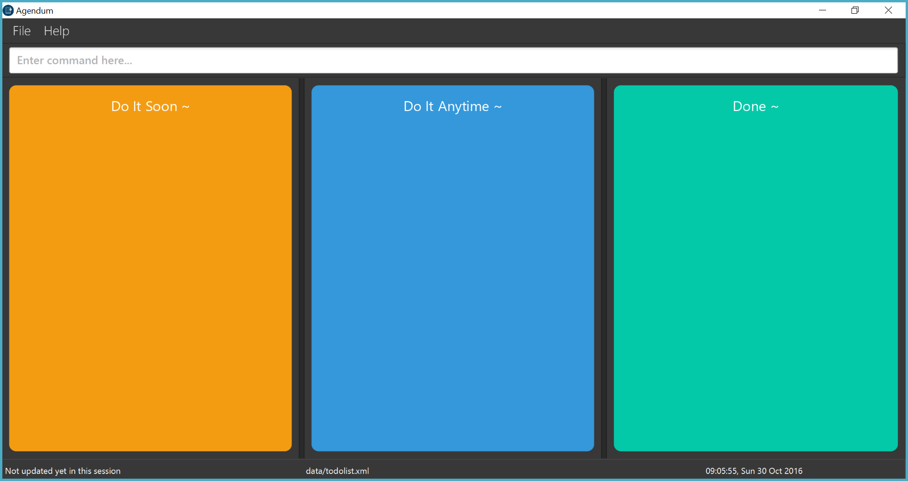
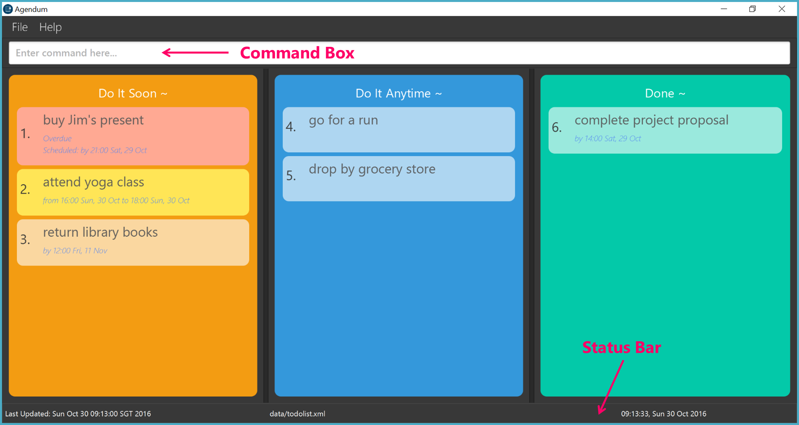
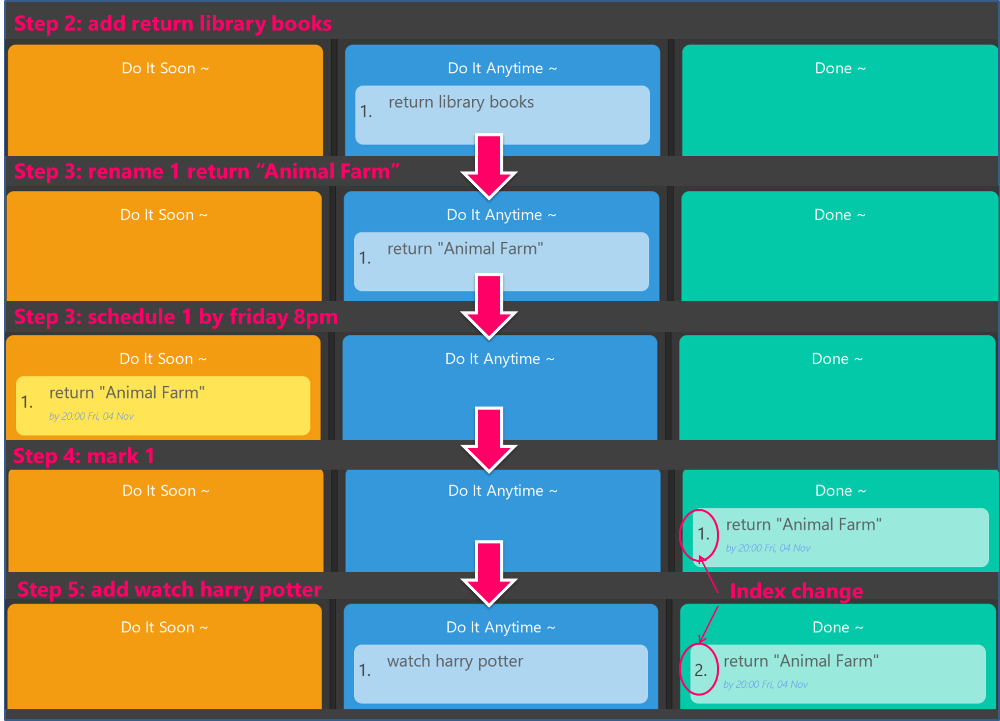
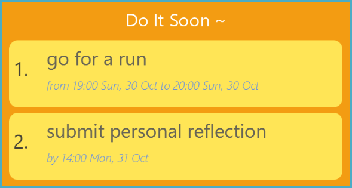

# User Guide
* [Introduction](#introduction)
* [Getting Started](#getting-started)
    * [Download](#download)
    * [Launch](#launch)
    * [Visual Introduction](#visual-introduction)
    * [Start using Agendum](#start-using-agendum)
* [Features](#features)
* [FAQ](#faq)
* [Command Summary](#command-summary)

&nbsp;

[comment]: # (@@author A0148095X)
## Introduction
Hi there! Do you have too many tasks and are unable to keep track of all of them? Are you looking for a hassle-free task manager which works swiftly?

Enter Agendum.

This task manager will assist you in completing all your tasks on time. It will automatically sort your tasks by date so you can always see the most urgent tasks standing out at the top of the list!

Agendum is simple, efficient, flexible and phenomenally keyboard friendly. With just one line of command, Agendum will carry out your wishes. You don’t ever have to worry about having to click multiple buttons and links. Agendum is even capable of supporting your own custom command words! This means that you can get things done even faster, your way.


&nbsp;


[comment]: # (@@author A0003878Y)
## Getting Started

### Download

1. Ensure that you have Java version `1.8.0_60` or above installed on your computer.
2. Download the latest `Agendum.jar` from [here](../../../releases).<br>
<br>
3. Copy the jar file to the folder that you intend to use as the root directory of Agendum.

### Launch

To launch Agendum, double-click on `Agendum.jar` to launch Agendum. Welcome! Here is the main window you will be greeted with. Initially the task panels are empty but fill them up with tasks soon.

<br>

[comment]: # (@@author A013367E)
### Visual Introduction

Here is what Agendum may look like with some tasks added and completed.

<br>

Notice how Agendum has 3 panels: **"Do It Soon"**, **"Do It Anytime"** and **"Done"**.
* **"Do It Soon"** panel will show your **uncompleted** tasks with deadlines and events. Those tasks demand your attention at or by some specific time! Agendum has helpfully sorted these tasks by their deadline or happening time.
    * **Overdue** tasks _(e.g. buy Jim's present)_ will stand out in pink at the top of the list.
    * **Upcoming** tasks (happening/due within a week) _(e.g. attend yoga class)_ will stand out in yellow next.
* **"Do It Anytime"** panel will show your **uncompleted** tasks which you did not specify a deadline or happening time. Do these tasks anytime.
* **"Done"** panel will show all your completed tasks. To make it easier for you to keep track of what you have done recently, Agendum will always show the latest completed tasks at the top of the list.

Agendum will clearly display the name and time associated with each task. Notice that each task is displayed with a ID. For example, the task *drop by grocery store* has a ID *5* now. We will use this ID to refer to the task for some Agendum commands.

The **Command Box** is located at the top of Agendum. Enter your keyboard commands into the box!
Just in case, there is a **Status Bar** located at the bottom of Agendum. You can check today's date and time, where your Agendum's to-do list data is located and when the data was last saved.

Agendum also has a pretty **Help Window** which summarizes the commands you can use and pop-ups after each commands for you to review your changes.


[comment]: # (@@author A0148031R)
### Start using Agendum
*This is only a brief introduction and suggestion on how to get started with Agendum. Refer to our [Features](#features) section, for a more extensive coverage on what Agendum can do.*

**Step 1 - Get some help**

Feeling lost or clueless? To see a summary of Agendum commands, use the keyboard shortcut <kbd>F5</kbd> to bring up the help screen as shown below. Press <kbd>ESC</kbd> to close the window when done.

**Step 2 - Add a task**

Perhaps, you can start by adding a task to your empty Agendum to-do list. For example, you might remember you have to return your library books. Type the following line in the command box:

`> add return library books`

Since you did not specify a time to return the books, Agendum will add this task to the **Do It Anytime** panel. The task *return library books* has a ID *1* now.

**Step 3 - Update your task (if needed)**

You might change your mind and want to update the details of the task. For example, you might only want to return a single book "Animal Farm" instead. Type the following line in the command box:

`> rename 1 return "Animal Farm"`

Agendum will promptly update the changes. What if you suddenly discover the book is due within a week? You will want to return "Animal Farm" by Friday night. To (re)schedule the task, type the following command:

`> schedule 1 by friday 8pm`

Since you will have to return your books by a specific time, Agendum will move this task to the **Do It Soon** panel.

**Step 4 - Mark a task as completed**

With the help of Agendum, you remembered to return "Animal Farm" punctually on Friday. Celebrate by marking the task as completed. Type the following line in the command box:

`> mark 1`

Agendum will move the task _return "Animal Farm"_ to the **Done** panel.

**Step 5 - Good to go**

Continue exploring Agendum. Add more tasks to your Agendum to-do list and try out the various convenient commands given in the next section. Do note that the ID of the task might change as new tasks are added, updated and marked. Agendum takes care of it for you but you should always refer to the current ID displayed.

Here is a **summary of all the visual changes** you should see at every step:
<br>

&nbsp;


[comment]: # (@@author A0003878Y)
## Features

### Commands

> **Here are some general things to note:**
> * All command words are case-insensitive. e.g. `Add` will match `add`
> * Words enclosed in angle brackets, e.g.`<name>` are the parameters. You can freely decide what to replace them by.
> * Parameters with `...` after them can have multiple instances (separated by whitespace). For example, `<index>...` means that you can specify multiple indices such as `3 5 7`.

### Adding a task: `add`

If you have a task to work on, add it to the Agendum to start keeping track! <br>

Here are the *acceptable format(s)*:

* `add <name>` - adds a task which can be done anytime.
* `add <name> by <deadline>` - adds a task which have to be done by the specified deadline. Note the keyword `by`.
* `add <name> from <start-time> to <end-time>` - adds a event which will take place between start time and end time. Note the keyword `from` and `to`.

Here are some *examples*:

```
Description: I want to watch Star Wars but I don't have a preferred time.
> add watch Star Wars
Result: Agendum will add a task to the "Do It Anytime" panel.

Description: I need to return my library books by the end of this week. There is a deadline!
> add return library books by Friday 8pm
Result: Agendum will add a task "return library books" to the "Do It Soon" panel.
It will have a deadline set to the nearest upcoming Friday and with time 8pm.

Description: I have a wedding dinner which will take place on the night of 30 Oct.
> add attend wedding dinner from 30 Oct 7pm to 9.30pm
Result: Agendum will add a task "attend wedding dinner" to the "Do It Soon" panel.
It will have a start time 30 Oct 7pm and end time 30 Oct 9.30pm.
```

> A task cannot have a deadline and a event time at the same time. A wrong start and end time might be saved.


##### Date Time Format
How do you specify the `<deadline>`, `<start-time>` and `<end-time>`? Agendum supports a wide variety of date time formats. Combine any of the date format and time format below. Note that the date/time formats are not case sensitive.

*Date Format*

| Date Format     | Example(s)           |
|-----------------|----------------------|
| Month/day       | 1/23                 |
| Day Month       | 1 Oct                |
| Month Day       | Oct 1                |
| Day of the week | Wed, Wednesday       |
| Relative date   | today, tmr, next wed |

 > It is possible to specify the year before or after the month-day pair in the first 3 formats (e.g. 1/23/2016 or 2016 1 Oct)
 > The day of the week refers to the following week. For example, today is Sunday (30 Oct). Agendum will interpret Wednesday and Sunday as 2 Nov and 6 Nov respectively (a week from now).

*Time Format*
Time Format       | Example(s)                              |
|-----------------|-----------------------------------------|
| Hour            | 10, 22                                  |
| Hour:Minute     | 10:30                                   |
| Hour.Minute     | 10.30                                   |
| HourMinute      | 2200                                    |
| Relative time   | this morning, this afternoon, tonight   |

> By default, we use the 24 hour time format but we do support the meridian format as well e.g. 10am, 10pm

Here are some examples of the results if these formats are used in conjunction with the `add` command.  
```
> add submit homework by 9pm
Result: The day is not specified. Agendum will create a task "submit homework"
with deadline today (the date of creation) and time 9pm

> add use coupons by next Wed
Result: The time is not specified. Agendum will create a task "use coupons"
with deadline the upcoming Wednesday and time now.

> add attend wedding dinner from 10 Nov 8pm to 10 Nov 9pm
Result: All the date and time are specified and there is no ambiguity at all.
However, with Agendum, you can skip typing the second date:
> add attend wedding dinner from 10 Nov 8pm to 9pm
```


[comment]: # (@@author A0133367E)
### Renaming a task : `rename`

Agendum understands that plans and tasks change all the time. <br>
If you wish to update or enhance the description of a task, you can use the following command.

Here is the *format*:

* `rename <id> <new-name>` - give a new name to the task identified by `<id>`. The `<id>` must be a positive number and in the most recent to-do list displayed.

Here is an *example*:<br>
<br>

```
Description: I just realized there is a typo for the task with id #2 "Watch Hary Potter".
To update the name of the task,
> rename 2 Watch Harry Potter
```

Agendum will promptly update the displayed <br>
<br>


### (Re)scheduling a task : `schedule`

Agendum recognizes that your schedule might change, and therefore allows you to reschedule your tasks easily.

Here are the *acceptable format(s)*:

* `schedule <id>` - re-schedule the task identified by <id>. It can now be done anytime and not by a deadline or within a specific time.
* `schedule <id> by <deadline>` - set or update the deadline for the task identified. Note the keyword `by`.
* `schedule <id> from <start-time> to <end-time>` - update the start/end time of the task identified by id. Note the keyword `from` and `to`.

> Again, `<id>` must be a positive number and in the most recent to-do list displayed.

> `<deadline>`, `<start-time>` and `<end-time>` must follow the format previously defined in [Date Time Format](#date-time-format)

> A task cannot have a deadline and a event time at the same time. A wrong start and end time might be saved.  

Here are some *examples*:<br>
<br>

```
Description: I decide that I can go for a run at any time instead.
> schedule 1
Result: Agendum will start/end time of the task "go for a run" and it will
move to the "Do It Anytime" panel

Description: I want to submit by reflection earlier.
> schedule 2 by tmr 2pm
Result: Agendum will update the deadline of "submit personal reflection". It
will then be sorted in the "Do It Soon" panel.

Description: I decide to go for a run at a later time.
> schedule 1 from 10pm to 11pm
Result: Agendum will update the start time of "go for a run" to today 10pm and
end time to today 11pm.
```


#### Marking a task as completed : `mark`

Have you completed a task? Well done! <br>
Now record this in Agendum by identifying the index of the task and type in the following command:

Format: `mark INDEX...`

> * Mark the task at the specified `INDEX`.
> * The index refers to the index number shown in the most recent listing.
> * The index **must be a positive integer** 1, 2, 3, ...
> * The index can be in any order.

Examples:  

* `list`<br>
  `mark 5`<br>
  Marks the 5nd task in the list. Task 5 will then be moved to the **"Done"** panel as described below<br>
  <br>


* `find Homework`<br>
  `mark 1`<br>
  Marks the 1st task in the list of results of the `find` command.

Sometimes, you might have had a productive day; Agendum saves you the hassle of marking multiple tasks one by one. <br>
To mark multiple tasks, try out any of the following examples:

* `list`<br>
  `mark 2 3 4`<br>
  `mark 2,3,4` <br>
  `mark 2-4` <br>
  Each of the above command will mark the 2nd, 3rd and 4th task as completed.  


#### Unmarking a task as completed : `unmark`

You might change your mind and want to continue working on a recently completed task.
To reflect these changes in Agendum, follow this command:

Format: `unmark INDEX...`

This works in the same way as the `mark` command. The tasks will then be moved to the **"Do It Soon"** or **"Do It Anytime"** panel accordingly. <br>


#### Deleting a task : `delete`

There are some tasks which will never get done and are perhaps no longer relevant. <br>
You can remove these tasks from the task list by using the following command:

Format: `delete INDEX...`  

> * Deletes the task at the specified `INDEX`.
> * The index refers to the index number shown in the most recent listing.
> * The index **must be a positive integer** 1, 2, 3, ...

Examples:  

* `list` <br>
  `delete 2` <br>
  Deletes the 2nd task in the task list.

* `find movie` <br>
  `delete 1` <br>
  Deletes the 1st task in the results of the `find` command.

You can also delete multiple tasks in the task list with a single command.

Examples:

* `list` <br>
  `delete 2 3 4` <br>
  `delete 2,3,4` <br>
  `delete 2-4` <br>
  Each of the above command will delete the 2nd, 3rd and 4th task in the task list.  


[comment]: # (@@author A0148031R)
#### Undo the last command : `undo`  

If you have accidentally made a mistake in the previous command, you can use 'undo' to remedy it.<br>
Multiple undo actions are also supported.

Format: `undo`

Examples:

* `add homework`<br>
  `undo`<br>
  The task "homework" which has been added previously, will be removed.


#### Finding tasks containing keywords: `find`

As your task list grows over time, it may become harder to locate a task.<br>
Fortunately, Agendum can search and bring up these tasks to you. Enter the following command: <br>
Format: `find KEYWORD``...`  

  > * The search is not case sensitive. e.g `assignment` will match `Assignment`
  > * The order of the keywords does not matter. e.g. `2 essay` will match `essay 2`
  > * Only the name is searched
  > * Only full words will be matched e.g. `work` will not match `homework`
  > * Tasks matching at least one keyword will be returned (i.e. `OR` search). e.g. `2103` will match `2101 and 2103 assignment`

Examples:  

* `find Dory` <br>
  Returns `Shark & Dory` and `dory`  

* `find Nemo Dory` <br>
  Returns all tasks that contain `Dory` or `Nemo`  


#### Retrieving task list : `list`

After you are done searching for tasks, you can use the following command to return to the default view of task lists: <br>
Format: `list`


[comment]: # (@@author A0148095X)
#### Creating an alias for a command : `alias`

Perhaps you want to type a command faster, or change the name of a command to suit your needs; <br>
fret not, Agendum allows you to define your own aliases for commands. <br>
You can use both new and old command aliases to carry out the same action.

Format: `alias ORIGINAL_COMMAND_NAME NEW_COMMAND_NAME`  

> * NEW_COMMAND_NAME must be a single word.
> * ORIGINAL_COMMAND_NAME must be a command word that is specified in the Command Summary section
> * When creating an alias for a command with a pre-existing alias, it can also be used to carry out that command.

Examples:

* `alias mark m` <br>
  you can now use`m` or `mark` to mark a task as completed.<br>
  `alias mark mk`<br>
  Now you can use `m`, `mk` or `mark` to mark a task.


#### Removing an alias command : `unalias`

Is a current alias inconvenient? Have you thought of a better one? <br>
Or perhaps you are thinking of using an alias for another command. <br>
To remove a previously defined alias, type:

Format: `unalias ALIAS_FOR_COMMAND_NAME`

> * ALIAS_FOR_COMMAND_NAME must be one of the user-defined command words.
> * Once it has been removed, you can still use the original command word or other unremoved aliases.

Examples:

Assume that mark has been aliased with `m` and `mk`.
* `unalias m`<br>
  `m` can no longer be used to mark tasks; now you can only use the original command `mark` or `mk` to mark a task as completed.

Similarly, you can also use the following command:
* `unalias mk`<br>
  `mk` can no longer be used to mark tasks; now you can only use the original command `mark` to mark a task as completed.


#### Viewing help : `help`

  If you need some reminder or more information about the features available, you can use the `help` command.

  Format: `help`  
  > Help is also shown if an incorrect command is entered e.g. `run`


#### Specifying the data storage location : `store`

Are you considering moving Agendum’s data files to another file directory?
You might want to save your Agendum task list to a Cloud Storage service so you can easily access from another device.
Agendum offers you the flexibility in choosing where the task list data will be stored.
The task list data will be saved to the specific directory, and future data will be saved in that location.

Format: `store PATH_TO_FILE`

> * PATH_TO_FILE must be a valid path to a file on the local computer.
> * If a file at PATH_TO_FILE exists, it will be overriden.
> * The previous data storage file will not be deleted.

Examples:
* `store C:/Dropbox/mytasklist.xml`


#### Loading from another data storage location : `load`

After relocating Agendum’s data files, you might want to load that exact copy of Agendum’s task list from a certain location, or from a Cloud Storage service. Agendum also offers you the flexibility to choose which data files to import.

Format: `load PATH_TO_FILE`

> * PATH_TO_FILE must be a valid path to a file on the local computer.
> * Existing data will be saved and stored in the existing data storage location.
> * The task list in Agendum will be replaced by the loaded task list.
> * Future data will be stored in PATH_TO_FILE.

Examples:
* `load C:/Dropbox/mytasklist.xml`

#### Exiting the program : `exit`

Are you done with organizing your tasks? Well done! <br>
To leave Agendum, type `exit`.

Format: `exit`  


### Keyboard Shortcuts

1. Use the <kbd>UP ARROW</kbd> and <kbd>DOWN ARROW</kbd> to scroll through earlier commands.
2. If you are entering a new command, use the <kbd>DOWN ARROW</kbd> to instantly clear the command line.


### Saving the data

Agendum saves its data into the specified data storage location, or by default it saves into `todolist.xml`. This saving automatically happens whenever the task list is changed; There is no need to save manually.


&nbsp;


## FAQ

<html>
<dl>
   <dt> Q: How do I transfer my data to another computer? </dt>
   <dd> Firstly, take note of the data storage location that your current todo list is saved at. You can check this by looking at the            bottom-right of Agendum. Navigate to this location and copy the data file to a portable USB device or hard disk. Then, ensure            that you have installed Agendum in the other computer. Copy the data file from your device onto the other computer, preferrably          in the same folder as Agendum. Use the <code>load</code> command to load it into Agendum. </dd>

   <dt> Q: Why did Agendum complain about an invalid file directory? </dt>
   <dd> Check if the directory you wish to relocate to exists, or if you have enough administrator privileges. </dd>

   <dt> Q: Can Agendum remind me when my task is due soon? </dt>
   <dd> Agendum will always show the tasks that are due soon at the top of list. However, Agendum will not show you a reminder. </dd>

   <dt> Q: Why did Agendum complain that the task already exists? </dt>
   <dd> You have previously created a task with the same name, start and end time. The tasks have the same completion status too! Save the trouble of creating one or it will be helpful to distinguish them by renaming instead.

   <dt> Q: Why did Agendum reject my alias for a command? </dt>
   <dd> The short-hand command cannot be one of Agendum’s command keywords (e.g. add, delete) and cannot be concurrently used to alias            another command (e.g. m cannot be used for both mark and unmark). </dd>

</dl>
</html>

&nbsp;

[comment]: # (@@author A0133367E)
## Command Summary

Command  | Format  
:-------:| :--------
Add      | `add TASK_NAME` or `add TASK_NAME by DATE_TIME` or `add TASK_NAME from START_DATE_TIME to END_DATE_TIME`
Alias    | `alias ORIGINAL_COMMAND_NAME NEW_COMMAND_NAME`
Delete   | `delete INDEX...`
Exit     | `exit`
Find     | `find KEYWORD...`
Help     | `help`
List     | `list`
Load     | `load PATH_TO_FILE`
Mark     | `mark INDEX...`
Rename   | `rename INDEX NEW_NAME`
Schedule | `schedule INDEX` or `schedule INDEX by DATE_TIME` or `schedule INDEX from START_DATE_TIME to END_DATE_TIME`
Select   | `select INDEX`
Store    | `store PATH_TO_FILE`
Unalias  | `unalias NEW_COMMAND_NAME` or `unalias ORIGINAL_COMMAND_NAME`
Undo     | `undo`
Unmark   | `unmark INDEX...`

For a quick reference,
> * Words in `UPPER_CASE` are the parameters.
> * Parameters with `...` after them can have multiple instances (separated by whitespace).
